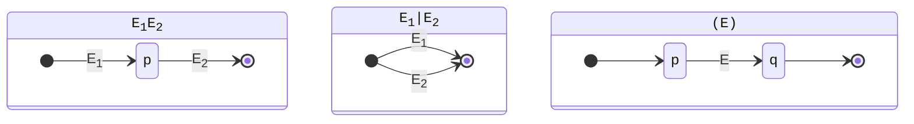
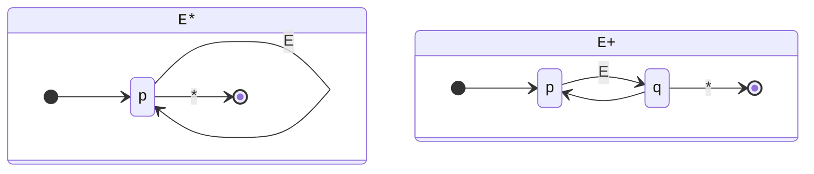
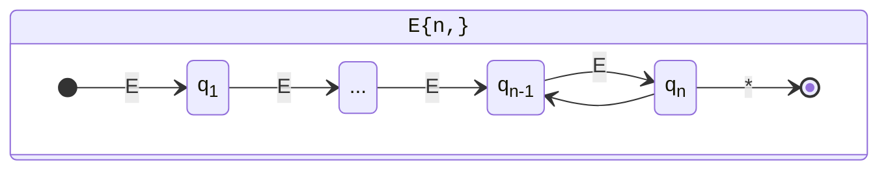
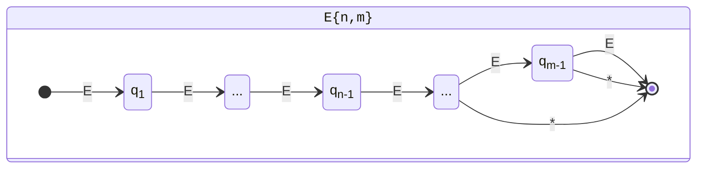

# 形式语言与自动机 大作业文档

## 一、编程语言与环境

编程语言：`C++`

操作系统：`Windows 10 x64 (version 22H2)`

编译器：`GCC 13.1.0 (x86_64-posix-seh-rev1)`

## 二、主要实现思路

### 1. 第一次实验

编写 `NFAExecutor` 类，用于 NFA 的带路径执行。

递归进行深度优先搜索，到达某个状态时依次尝试所有可行的转移边，当找到一条接受路径时回溯，在回溯过程中构造 `Path`。

在搜索过程中，当前状态 $q$ 和剩余字符串 $w$ 组成的二元组 $(q,w)$ 相当于 NFA 的即时表示，将所有访问过的 $(q,w)$ 缓存可以避免在 $\epsilon$ 转移中无限循环，同时对搜索剪枝。

若将 NFA 规模视为常数，则算法时空复杂度均与输入串长度成线性。

### 2. 第二次实验

编写 `RegexCompileListener` 类，给定正则表达式的语法分析树，自底向上将每棵子树编译得到 NFA 片段，最终将 NFA 片段组装成完整的 NFA。

使用 `NFAFragment` 类存储 NFA 片段。每个 NFA 片段包含一个初态和一个终态，可选的额外状态，以及状态间的转移边。

- 状态间的转移边分两种：普通的 `Rule`，或是另一个 NFA 片段，此时转移边的出发和到达状态分别对应子片段的初态和终态。所有的 NFA 片段形成一个类似树形的结构。
- 为便于设计 NFA 片段，要求初态没有入边，终态没有出边。
- 将 NFA 片段组装成完整的 NFA 时，自顶向下递归组装。组装时，初态和终态由父片段提供，只需要为额外状态分配编号。
- 组装完成后，添加一个从初态回到初态、可消耗任意字符的转移，使得匹配可以从输入字符串的任意位置开始。接受路径中从离开初态到抵达终态过程中消耗的所有字符即为匹配串。

正则表达式中每种运算对应的 NFA 片段构建方式如下。

#### 1. 连接运算，或运算，捕获分组

注：捕获分组中状态 $p$ 和 $q$ 分别作为捕获组的开始和结束标志，用于指示接受路径经过捕获组。

#### 2. 星闭包和正闭包

注 1：标有星号的是 $\epsilon$ 转移，在贪婪匹配时最后添加，在非贪婪匹配时最先添加。

注 2：`E?` 作为 `E{0,1}` 处理。

#### 3. 范围量词

注 1：对 `E{n,}`，当 $n=0,1$ 时分别作为 `E*` 和 `E+` 处理。

注 2：`E{n}` 作为 `E{n,n}` 处理。

### 3. 第三次实验

对于正则表达式的 flags，将不同 flags 下的 `^$.` 用不同的标记表示，需要在编译 NFA 片段时增加一些判断。

对于 anchor 字符，添加 `ANCHOR` 类型的 `Rule`，和 $\epsilon$ 转移类似，但只匹配某些特定的位置。

对于捕获分组，当接受路径经过开始和结束标志时分别记录当前位置，最后还原即可。

对于 `matchAll` 和 `replaceAll`，将单次匹配改为循环匹配，每次从上一个匹配的结尾继续匹配，注意特殊处理匹配为空串的情况。实现 `replaceAll` 还需要一些简单的字符串处理。

## 三、实现重难点与解决方法

### 1. 组装 NFA 片段

**问题：** 编译过程中需要频繁组合多个 NFA 片段，如果直接在 `NFA` 类上操作会涉及到繁琐的新增状态、改变状态编号以及修改转移边等步骤，实现起来太复杂而且容易出错。

**解决方法：** 使用 `NFAFragment` 辅助类表示 NFA 片段，搭建类似树形的结构，最后一并组装所有的片段。

### 2. 处理贪婪匹配

**解决方法：** 贪婪匹配即跳出匹配的 $\epsilon$ 转移边应当最后遍历，非贪婪匹配反之。归纳出这个性质后，就可以用统一的代码处理贪婪和非贪婪匹配，只需对转移边打一个标记，并在组装时特殊处理。

### 3. 处理取反的字符集合

**问题：** NFA 的 `Rule` 并没有很好的方法处理形如 `[^abc]` 的字符集合。

**解决方法：** 考虑到只要求支持 ASCII 字符集，可以枚举找出所有可以匹配的字符，再用若干个区间转移覆盖它们。当然，这个方法不是很优美，这里提供两种改进思路：

1. 对状态打一个特殊标记，代表从这个状态出发的 `Rule` 匹配条件需要取反并求交。
2. 新增一种转移类型 `GROUP`，专门用于处理字符集合，可以在 `Rule` 中存储一个 `std::function<bool(char)>` 或 `std::vector<Rule>` 等用来判断字符是否能匹配。

### 4. 内存管理

**解决方法：** 明确数据结构的所有权，使用智能指针。